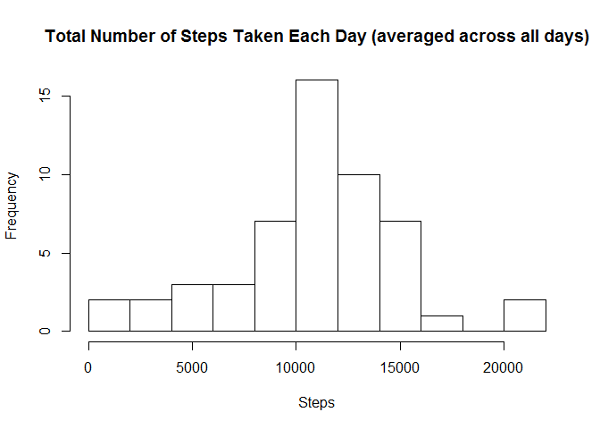
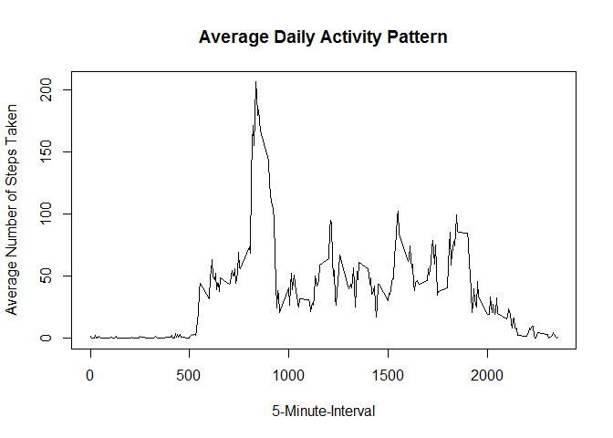
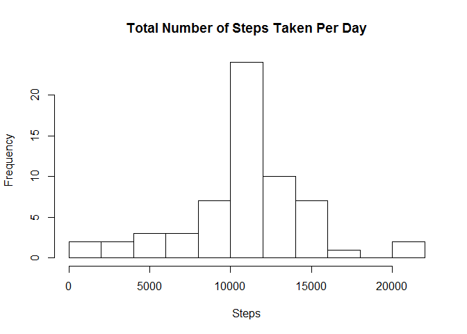
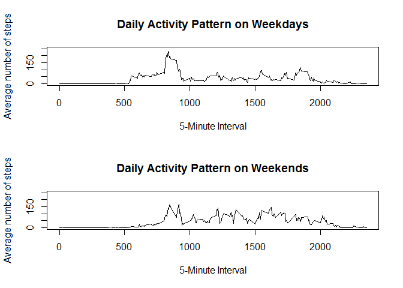

# Reproducible Research: Peer Assessment 1
Using data from an anonymous individual's personal activity monitoring device that collects data at 5 minute intervals through out the day during the months of October and November, 2012, the following analysis was made:

**Loading and preprocessing the data**

1. Loading the Data:

```r
setwd("D:/Users/Reka/Desktop/RepData_PeerAssessment1/RepData_PeerAssessment1")
filename <- unzip("activity.zip")
activity <- read.csv("activity.csv", stringsAsFactors = FALSE)
clean_activity<-activity[which(!is.na(activity$steps)),]
```
2. If any NA values are found, then process/transform the data to remove all NA values.  

```r
sum(is.na(activity$steps))
```

```
## [1] 2304
```

```r
activity <- read.csv("activity.csv", stringsAsFactors = FALSE)
clean_activity<-activity[which(!is.na(activity$steps)),]
```
Also ensure that date is in proper format.

```r
str(activity)
```

```
## 'data.frame':	17568 obs. of  3 variables:
##  $ steps   : int  NA NA NA NA NA NA NA NA NA NA ...
##  $ date    : chr  "2012-10-01" "2012-10-01" "2012-10-01" "2012-10-01" ...
##  $ interval: int  0 5 10 15 20 25 30 35 40 45 ...
```

```r
activity$date <- as.Date(activity$date)
str(activity)
```

```
## 'data.frame':	17568 obs. of  3 variables:
##  $ steps   : int  NA NA NA NA NA NA NA NA NA NA ...
##  $ date    : Date, format: "2012-10-01" "2012-10-01" ...
##  $ interval: int  0 5 10 15 20 25 30 35 40 45 ...
```
**What is mean total number of steps taken per day?**

1. The total number of steps taken per day is:

```r
steps_perday<-tapply(clean_activity$steps, clean_activity$date, sum)
clean_activity<-activity[which(!is.na(activity$steps)),]
```
2.Histogram of the total number of steps taken each day

```r
hist(steps_perday,15, main = "Total Number of Steps Taken Each Day (averaged across all days)", xlab = "Steps")
```

 

3. The mean of the total number of steps taken per day is 10766.19, while the median of the total number of steps taken per day is 10765.

```r
mean(steps_perday)
```

```
## [1] 10766.19
```

```r
median(steps_perday)
```

```
## [1] 10765
```
**What is the average daily activity pattern?**

1.

```r
average_steps<-tapply(clean_activity$steps, clean_activity$interval, mean)
plot(y = average_steps, x = names(average_steps), type = "l", xlab = "5-Minute-Interval", 
     main = "Average Daily Activity Pattern", ylab = "Average Number of Steps Taken")
```

 

```r
average_steps[average_steps==max(average_steps)]
```

```
##      835 
## 206.1698
```
2. The 835th interval has the maximum average number of steps throughout the days with 206.1698 steps.

```r
average_steps[average_steps==max(average_steps)]
```

```
##      835 
## 206.1698
```
**Imputing missing values**

1. The total number of missing values in the data set is:

```r
sum(is.na(activity))
```

```
## [1] 2304
```
2. The missing values in the dataset can be filled in using the mean of the 5-minute interval. 

```r
activity_complete <- activity
activity_complete[which(is.na(activity_complete$steps)),1]<-
  average_steps[as.character(activity_complete[which(is.na(activity_complete$steps)),3])]
```
3. Check new dataset to ensure that the missing data has been filled in.

```r
sum(is.na(activity_complete))
```

```
## [1] 0
```
4. Histogram of the total number of steps taken each day.

```r
steps_complete<-tapply(activity_complete$steps, activity_complete$date, sum)
hist(steps_complete,15, main = "Total Number of Steps Taken Per Day", xlab = "Steps")
```

 

The mean and median of the total number of steps taken per day in the filled in dataset are 10766.19.

```r
mean(steps_complete)
```

```
## [1] 10766.19
```

```r
median(steps_complete)
```

```
## [1] 10766.19
```
The difference in the mean and median between the estimates from the first part of the assignment and the new estimates are:

```r
mean(steps_complete)-mean(steps_perday)
```

```
## [1] 0
```

```r
median(steps_complete)-median(steps_perday)
```

```
## [1] 1.188679
```
**Are there differences in activity patterns between weekdays and weekends?**

1. New factor variable in the dataset with two levels indicating whether a given date is a weekday or weekend day will be created as follows:

```r
activity_complete$wd<-weekdays(activity_complete$date)
activity_complete$fwd<- as.factor(c("weekend", "weekday"))
activity_complete[activity_complete$wd == "Sunday" | activity_complete$wd == "Saturday" ,5]<- factor("weekend")
activity_complete[!(activity_complete$wd == "Sunday" | activity_complete$wd == "Saturday"),5 ]<- factor("weekday")
```
2. A panel plot containing a time series plot of the 5-minute interval (x-axis) and the average number of steps taken, averaged across all weekday days or weekend days (y-axis):

```r
activity_complete_we <- subset(activity_complete, fwd == "weekend") 
activity_complete_wd <- subset(activity_complete, fwd == "weekday") 
steps_weekend<-tapply(activity_complete_we$steps, activity_complete_we$interval, mean)
steps_weekday<-tapply(activity_complete_wd$steps, activity_complete_wd$interval, mean)
par(mfrow=c(2,1))
plot(y = steps_weekday, x = names(steps_weekday), type = "l", xlab = "5-Minute Interval", 
     main = "Daily Activity Pattern on Weekdays", ylab = "Average number of steps", 
     ylim =c(0, 250))
plot(y = steps_weekend, x = names(steps_weekend), type = "l", xlab = "5-Minute Interval", 
     main = "Daily Activity Pattern on Weekends", ylab = "Average number of steps", 
     ylim =c(0, 250))
```

 
